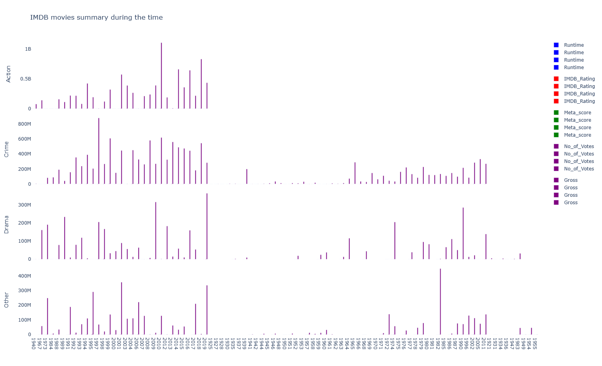
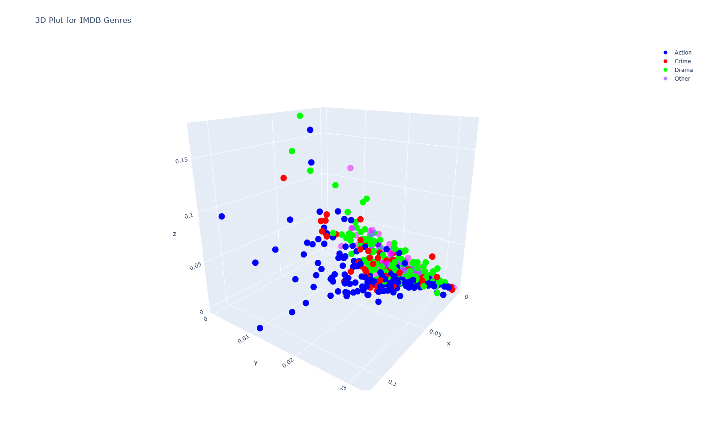

# IMDB Movie Classification Research
## Overview
This project explores a dataset of 1000 IMDb movies to identify patterns and predict movie attributes using various machine learning classifiers. Our main goal was to determine which algorithm provides the most accurate predictions.
We started with exploratory research, mostly by creating different graphs with the data to see what trends we could find. This is shown below, and we found that action movies tend to gross higher than movies of other genres.

## Research Objectives
To compare the performance of different classification algorithms.
To visualize the accuracy of each model using 3D graphs in Python.

## Methodology
We started by making small graphs to find trends in the data. Then, we divided the data into train and test groups so that we could train the algorithms and have some data left over to tests the algorithms against. 
We utilized several classifiers like KNeighbors, ExtraTrees, and DecisionTree. The dataset included movie attributes such as director, rating, etc. Our analysis involved data cleaning, model training, and result evaluation.

## Results
The ExtraTrees classifier outperformed others in terms of accuracy. Detailed comparisons and performance metrics are included.

Here we can see that action movies tend to gross the highest, with their purple bars reaching towards the 1 billion mark.

Movies higher on the z-axis have a higher gross, so we can see action movies tend to gross higher than other genres of movies.

## Visualizations
Graphs to help us see pattern in the data.
Graphs illustrating the accuracy comparisons of each model provide insights into their predictive power.

## Challenges and Learnings
We had to modify the code to be able to handle movies with no input in certain categories (i.e. if no world gross was provided). 
Relatively small dataset which lead to limited accuracy.
Only tested the data on the original dataset.

## Future Work
I am interested to see if the ExtraTrees classifier is most accurate for all IMDB datasets and why that is. 
What other datasets the ExtraTrees would be best at making predictive models for?

## Contact
For further inquiries or collaboration, please reach out to majestichillary@gmail.com.

Your feedback and contributions are welcome!
